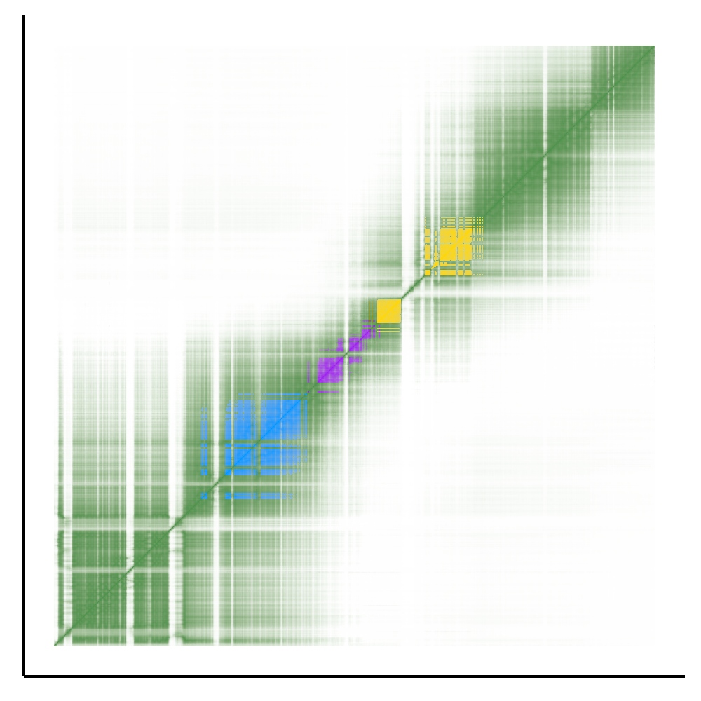
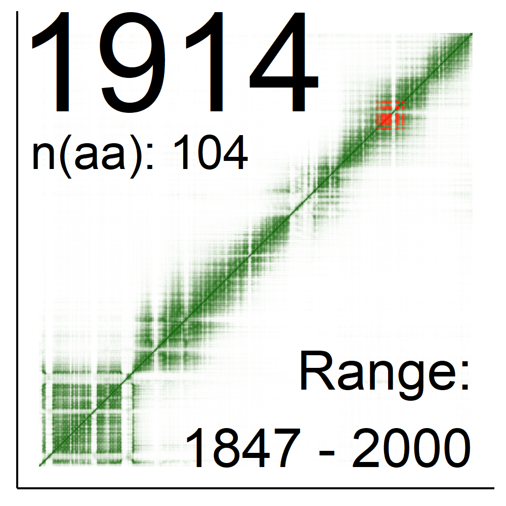

# Protein-Variant-Phenotype Study of NBAS using AlphaFold in the Aspect of SOPH Syndrome

This repository contains the supplementary materials and code for the article "Protein-variant-phenotype study of NBAS using AlphaFold in the aspect of SOPH syndrome".

## Contents

1. [Heatmap Data for Binding Sites](#heatmap-data-for-binding-sites)
2. [Pymol Scripting and Mapping Predicted Binding Sites](#pymol-scripting-and-mapping-predicted-binding-sites)
3. [PAE Plots and Mapping Binding Sites](#pae-plots-and-mapping-binding-sites)
4. [Mapping Phenotyping Traits onto PAE Plot](#mapping-phenotyping-traits-onto-pae-plot)
5. [Supplementary Materials](#supplementary-materials)

---

## Heatmap Data for Binding Sites

This section contains the scripts and data to generate heatmaps for the binding sites of the proteins using seaborn, matplotlib, and other libraries.

**Libraries Used:**
- seaborn
- matplotlib.pyplot
- matplotlib.colors.LinearSegmentedColormap
- pandas
- numpy
- json

**Files:**
- `Heatmap_AF3.ipynb`
- `Heatmap_AF.ipynb`

**Example Output:**

Heatmap of USE1/NBAS binding site.

  

---

## Pymol Scripting and Mapping Predicted Binding Sites

This section includes the Pymol scripts and notebooks for mapping the predicted binding sites onto the NBAS protein.

**Files:**
- `figure 5 mol AF3.pse`
- `figure 5 mol.pse`
- `Figure 5.ipynb`
- `Figure 5-AF3.ipynb`

**Example Output:**

Binding sites are colored as follows: green - USE1, purple - Rab18, yellow - ZW10 (cyan stands for UPF3B putative binding site).

  

---

## PAE Plots and Mapping Binding Sites

This section covers the scripts for generating PAE plots and mapping the binding sites onto them.

**Libraries Used:**
- jsonlite
- ggnewscale
- scales
- reshape2
- ggplot2

**Files:**
- `Figure 6 batch bs comb AF3.R`
- `Figure 6 batch bs comb.R`
- `Figure 6.ipynb`
- `Figure 6-AF3.ipynb`

**Example Output:**

Binding sites are colored as follows: blue - USE1, purple - Rab18, yellow - ZW10.

  

---

## Mapping Phenotyping Traits onto PAE Plot

This section details the code for mapping phenotyping traits onto the PAE plot.

**Libraries Used:**
- jsonlite
- ggnewscale
- scales
- reshape2
- ggplot2

**Files:**
- `Figure 7 layers.R`
- `Figure 7 layers.ipynb`
- `Figure 7 pheno w-o sg.csv`

**Example Outputs:**

Subdomain affected by SOPH variant.

  

Phenotype map of Osteogenesis Imperfecta pathogenic variants.

  

---

## Supplementary Materials

The supplementary materials include phenotype and variants data, and details about AlphaFold runs performed for the article.

**Files:**
- `Supplementary table 1.xlsx`
- `Supplementary table 2.ods`

All data is too large to be loaded into GitHub and is available by request. Please contact me through my [personal GitHub page](https://github.com/LyonyaZhozhikov).
